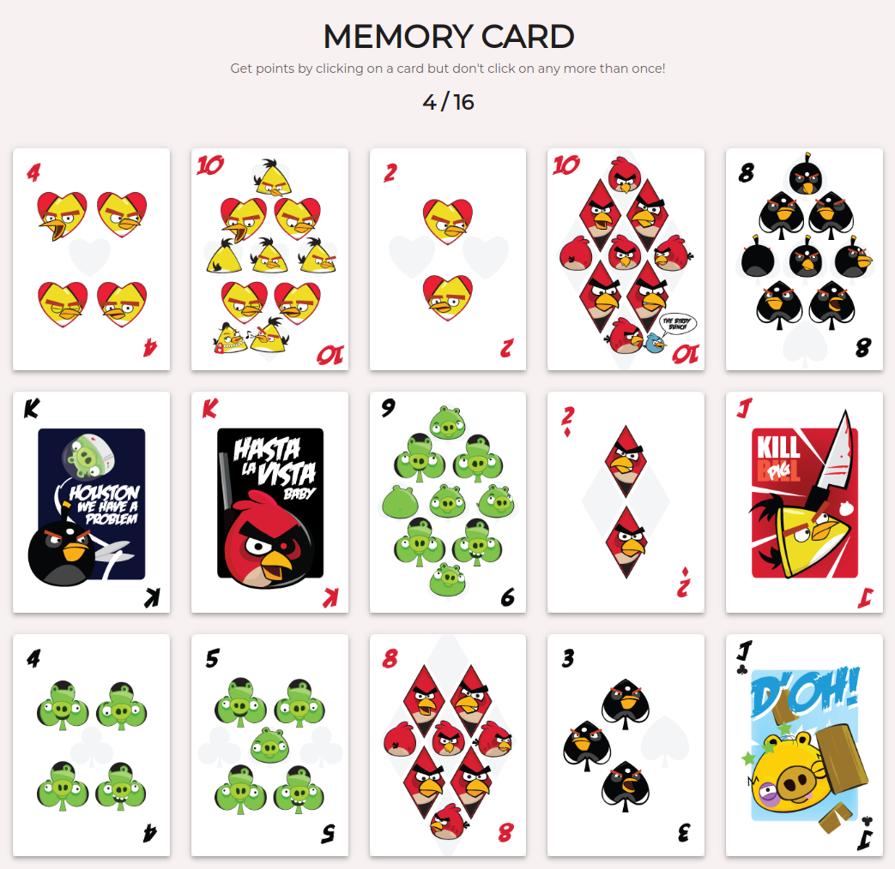

# Memory Card



This application implements the popular "Memory Card" game that enables users to improve their short/long term memory and it is the submission for  [The Odin Project: Memory Card](https://www.theodinproject.com/lessons/node-path-react-new-memory-card). 

The key features are:

- Ability to play independently
- Cards with significant differences for a better gaming experience
- Ability to play as many times as desired
- Cross-Platform Compatibility


<br/>

## Live Demo

[Memory Card](https://jesusgraterol.github.io/memory-card/)


<br/>

## Getting Started

### Requirements

- GIT
- NodeJS ^v21.0.0
- NPM ^v10.2.0

### Installation

1) Clone the repository
```bash
git clone git@github.com:jesusgraterol/memory-card-top.git
```

2) Install the dependencies
```bash
npm install
```


<br/>

## Usage

1) Run the Development Vite Server

```bash
npm run dev
```

2) Open `http://localhost:5173/` (the port may vary) with your favorite browser.


<br/>

## Build Process

Run the Vite Production Build
```bash
npm run build
```


<br/>

## Deployment

Push the new build to the `gh-pages` branch so it is deployed to **Github Pages**:

```bash
git subtree push --prefix dist origin gh-pages
```


<br/>

## Built With

- HTML5
- CSS3
- JavaScript
- React


<br/>

## Running the Tests

```bash
# Unit Tests
npm run test:unit

# Integration Tests
npm run test:integration

# E2E Tests
N/A
```


<br/>

## @TODO

- ...


<br/>

## License

[MIT](https://choosealicense.com/licenses/mit/)


<br/>

## Acknowledgments

- [Google Fonts](https://fonts.google.com/icons)
- [ESLint](https://eslint.org/)
- [Jest](https://jestjs.io/)
- [Babel](https://babeljs.io/)
- [Vite](https://vitejs.dev/)
- [React](https://react.dev/)
- [prop-types](https://github.com/facebook/prop-types)
- [FreeImages/@vector.me](https://freeimages.com/vector/angry-birds-vector-playing-card-deck-and-vector-characters-5498104)
